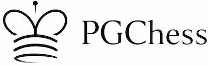
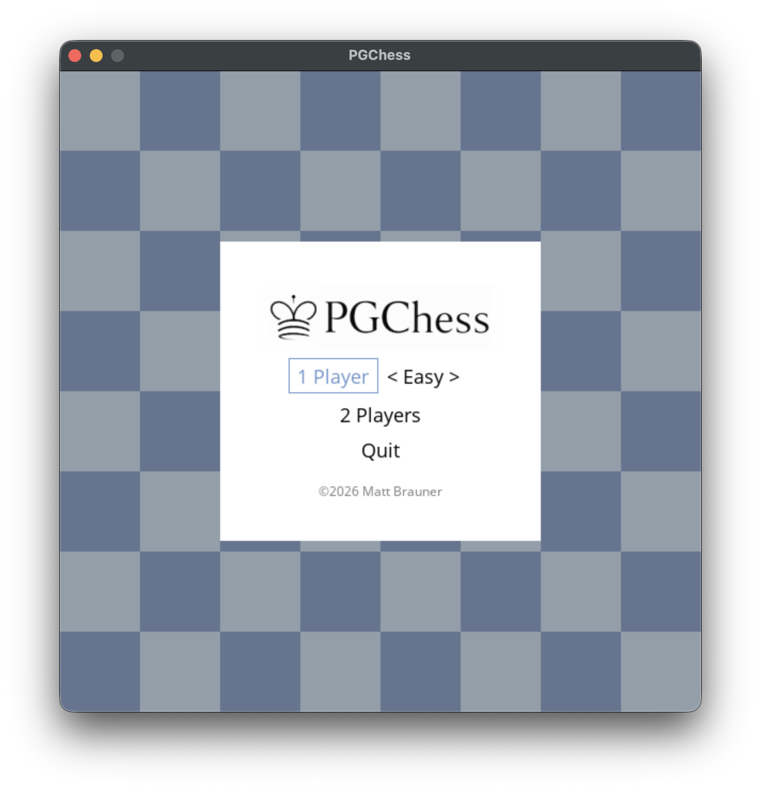

[](https://github.com/mb4828/PGChess/actions/workflows/build.yml)
[](https://github.com/mb4828/PGChess/actions/workflows/test.yml)
[](https://github.com/mb4828/PGChess/releases)

Python chess GUI using PyGame and Sunfish



### To Setup

```
python -m venv venv
source venv/bin/activate
pip install -r requirements.txt
```

### To Run

Python 3.11 or above
```
venv/bin/python main.py
```

### To Test

```bash
pip install pytest-cov
python -m pytest tests/ -v --cov=pgchess --cov-report=term-missing
```

### To Build

Use the build script that automatically detects your platform:

```bash
python build.py
```

This will create an executable in the `dist/` folder:
- **Windows:** Single-file executable `dist/PGChess.exe`
- **macOS:** App bundle `dist/PGChess.app` (drag to Applications folder)

### To Release

1. Bump `VERSION` in `version.py`
2. Commit and push to `main`
3. Create and push a version tag:

```bash
git tag v2026.2.1
git push origin v2026.2.1
```

This triggers the GitHub Actions build workflow, which builds both platforms and creates a GitHub Release automatically.